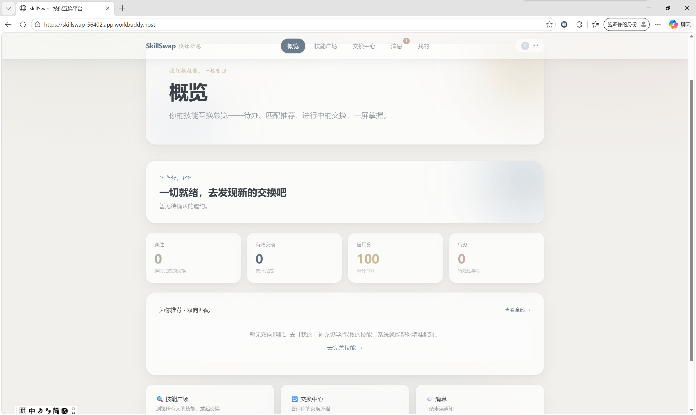
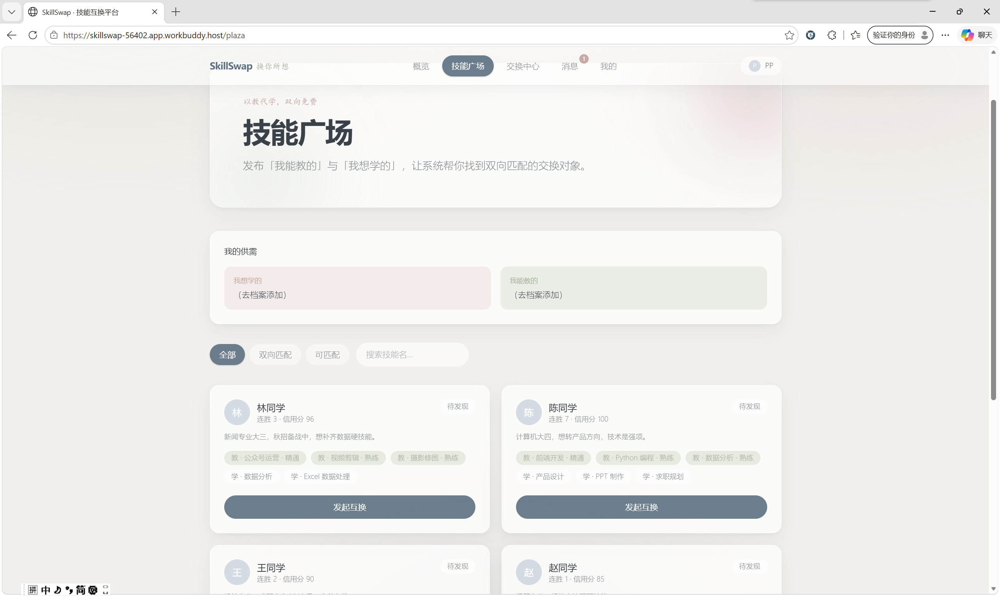
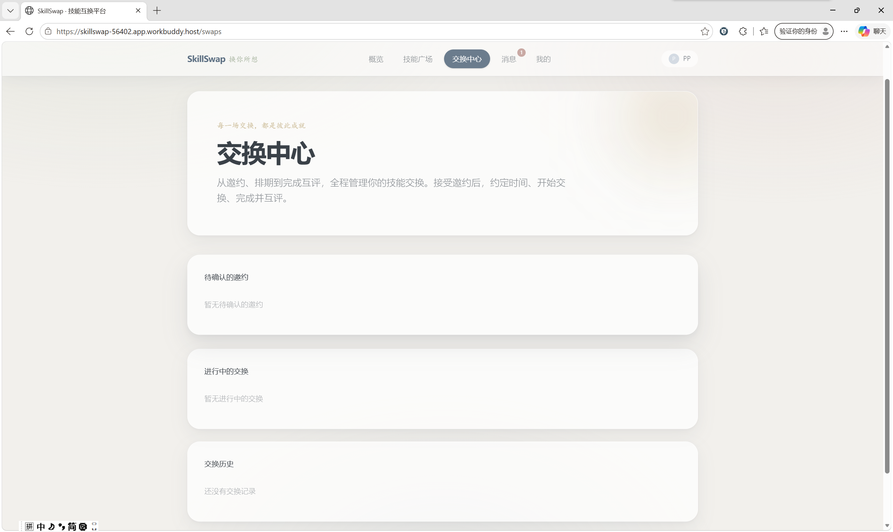
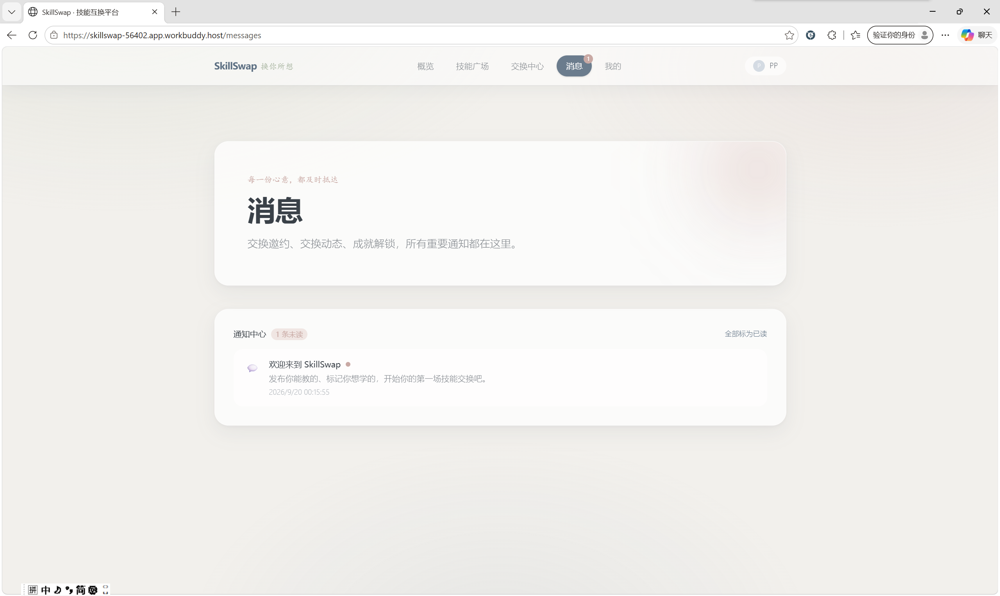

<p align="center">
  
</p>

<h1 align="center">SkillSwap · 技能互换平台</h1>

<p align="center">
  <b>「以教代学，双向免费」</b> —— 发布「我能教的」与「我想学的」，实现求职技能的双向匹配与交换。
</p>

<p align="center">
  
  
  
  
  
</p>

---

## 这是什么

SkillSwap 是一个面向**大学生求职者**的技能互换社区。很多人想补齐求职硬技能（数据分析、产品设计、英语口语……），但报班贵、自学难坚持、会的技能又缺少变现出口。

SkillSwap 的解法是**以教代学**：你不需要花钱，只需要拿出你会的技能，去换你想学的技能。平台通过「标签 + 自评等级」做精准匹配，帮你找到**双向匹配**的交换对象——他教的正是你想学的，你教的也正是他想学的。

> 这是一个人工智能协作开发的完整前端演示项目，数据存储在浏览器本地（localStorage），无后端依赖，可直接运行体验完整闭环。

---

## 项目截图

| 概览 | 技能广场 |
|:---:|:---:|
|  |  |

| 交换中心 | 消息中心 | 我的 |
|:---:|:---:|:---:|
|  |  |  |

---

## 功能清单

### 核心闭环
- **发布技能**：发布「我能教的」（自评熟练/精通）与「我想学的」
- **双向匹配**：算法自动识别「他教的我正好想学，且我教的他想学」的双向匹配
- **完整交换状态机**：

```
邀约(pending) → 已确认(confirmed) → 已排期(scheduled) → 进行中(ongoing) → 已完成(completed)
                    ↓                                                        ↑ 双方互评
                已拒绝(declined) / 已取消(cancelled)
```

### 产品机制
- **信用分**：互评驱动，5 星 +3、4 星 +1、3 星不变、1-2 星 -2（满分 100）
- **连胜机制**：借鉴多邻国，完成交换连胜 +1，激励持续学习
- **成就徽章**：7 个徽章（初次互换、三/七连胜、交换达人/大师、满分信誉、授人以渔），达成自动解锁
- **通知中心**：交换邀约、交换动态、成就解锁、系统通知，带未读红点

---

## 技术栈

| 层 | 技术 |
|---|---|
| 框架 | [Next.js 15](https://nextjs.org/)（App Router） |
| UI | [React 19](https://react.dev/) + [Tailwind CSS 4](https://tailwindcss.com/) |
| 语言 | TypeScript |
| 状态 | 自定义 store + `localStorage` 持久化（无后端） |
| 设计 | 莫兰迪水彩色系 + 玻璃拟态（Glassmorphism）+ 卡片分层 |

### 目录结构

```
skillswap-web/
├── app/
│   ├── page.tsx          # 概览（仪表盘）
│   ├── plaza/page.tsx    # 技能广场
│   ├── swaps/page.tsx    # 交换中心
│   ├── messages/page.tsx # 消息中心
│   ├── me/page.tsx       # 我的（档案 + 成就）
│   ├── globals.css       # 设计系统（莫兰迪色 + 玻璃拟态）
│   └── layout.tsx
├── components/
│   ├── AppNav.tsx        # 导航（未读红点）
│   ├── Overview.tsx      # 概览仪表盘
│   ├── Plaza.tsx         # 技能广场 + 匹配 + 邀请
│   ├── Swaps.tsx         # 交换中心（状态机 + 时间线 + 互评）
│   ├── Messages.tsx      # 通知中心
│   └── ProfilePanel.tsx  # 档案 + 技能 + 成就 + 设置
├── lib/
│   ├── store.ts          # 数据模型 + 状态机 + 持久化
│   └── useStore.ts       # React 状态订阅 hook
├── PRD.md                # 产品需求文档
└── package.json
```

---

## 产品思考

### 痛点
1. **报班贵**：求职技能培训动辄数千元，学生负担重
2. **难坚持**：一个人自学容易放弃，缺乏外部反馈
3. **技能缺变现出口**：很多人会的技能（公众号运营、视频剪辑、PPT）没有变现渠道

### 核心差异化
- **匹配效率**：标签 + 自评等级，让「供需」结构化、可检索
- **双向交换**：不是免费索取，而是价值对等的互换，降低白嫖与鸽率
- **游戏化坚持**：连胜 + 徽章 + 信用分，让学习像游戏一样上瘾

### 商业模式（设想）
- 免费 + 增值会员（优先匹配、更多技能位、数据分析报告）
- 后期可接入企业端（人才技能认证 + 内推）

### 风险与指标
- 核心风险：防白嫖 / 防鸽（对应机制：轻量信用分、互评）
- 核心指标：两周内二次交换率 ≥ 30%

> 完整产品设计见 [PRD.md](PRD.md)。

---

## 运行步骤

### 环境要求
- Node.js ≥ 18（推荐 20+）

### 1. 安装依赖

```bash
npm install
```

> 若国内网络慢，可换镜像：`npm install --registry=https://registry.npmmirror.com`

### 2. 启动开发服务器

```bash
npm run dev
```

打开浏览器访问 <http://localhost:3000>。

### 3. 生产构建与运行

```bash
npm run build
npm start
```

### 使用提示
- 首次打开会看到「未登录」状态，进入 **我的** 页面选择一个种子用户或创建新用户
- 数据保存在浏览器 localStorage，点击 **我的 → 重置演示数据** 可恢复初始状态

---

## License

MIT
